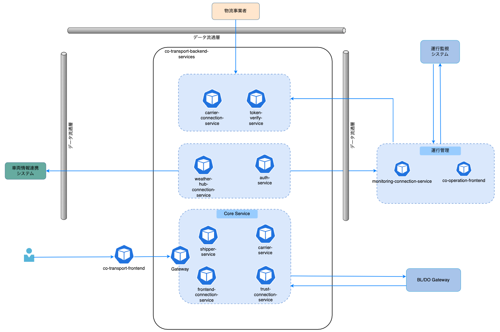

# 共同輸送システムプロジェクト - フロントエンド

## 概要・目的
このリポジトリは、共同輸送システムの一部であり、運行管理システムのフロントエンドです。本システムは、運行管理の効率化を図るとともに、共同輸送のコアシステムとの円滑な連携を実現し、ユーザーにとって使いやすいインターフェースを提供することを目的としています。
以下、アーキテクチャ概要を示す。  


本システムは[co-operation-frontend](https://github.com/ODS-IS-CAVC/co-operation-frontend.git)です。

## 前提環境
- **Node.js:** v18 以上 v22 以下

## ビルド・起動手順
### 1. リポジトリのクローン
```bash
git clone https://github.com/ODS-IS-CAVC/co-operation-frontend.git
cd co-operation-frontend
```

### 2. パッケージのインストール
```bash
npm install
```

### 3. 環境変数の設定
`.env.local` ファイルを作成し、以下のように環境変数を設定します。
```
|環境変数                |説明 |例 |
|:-------------------------------------------|:-------|:-------|
|NEXT_PUBLIC_API_TRANSACTION                 |[frontend-connection-service](https://github.com/ODS-IS-CAVC/co-operation-backend-services.git/frontend-connection-service)のサービスのURL |http://localhost:2200 |
|NEXT_PUBLIC_API_CARRIER                 |[carrier-service](https://github.com/ODS-IS-CAVC/co-operation-backend-services.git/carrier-service)のサービスのURL |http://localhost:2900 |
```
### 4. 必要なAPI開発サーバーの起動
- frontend-connection-serviceサーバーを起動する
- carrier-serviceサーバーを起動する

### 5. 開発サーバーの起動
```bash
npm run dev 
```
## テスト手順
ブラウザで `http://localhost:3000` にアクセスして確認してください。

## 設計標準
### ユーザーインターフェース
  - 直感的な操作性を重視したUI設計
  - レスポンシブデザインによるマルチデバイス対応

### システム連携
  - RESTful APIとの通信
  - エラーハンドリング

### コンポーネント設計
- Atomic Designパターンの採用
  - atoms: 最小単位のUIパーツ
  - molecules: 複数のatomsの組み合わせ
  - organisms: 特定の機能を持つ複合コンポーネント
  - templates: ページレイアウト
  - pages: 実際のページコンポーネント

### ディレクトリ構成
```
/frontend
├── public/            # 静的ファイル
├── src/
│   ├── components/    # UIコンポーネント
│   ├── apps/          # Next.js のページルーティング
│   ├── constants/     # 共通で使用する定数を定義
│   ├── store/         # Redux Toolkit ストア
│   ├── hooks/         # カスタムフック
│   ├── utils/         # ユーティリティ関数
│   ├── lib/           # 共通ライブラリを定義 (dayjs、マッチング計算など)
│   ├── images/        # プロジェクトで使用する画像を格納 (ロゴ、トレーラー、トラクターなど)
│   ├── icons/         # SVG アイコンを格納 (https://fonts.google.com/icons にない場合)
│   ├── styles/        # Tailwind のスタイル設定
│   ├── messages/      # 共通テキストファイルを格納
│   ├── services/      # API サービスを格納
│   └── config/        # 設定ファイル
└── .env.local         # 環境変数（ローカル専用）
```

## コーディング規約
- **コーディングスタイル:** ESLint + Prettier を使用
- **コミットメッセージ:** `feat: 新機能追加`, `fix: バグ修正`, `docs: ドキュメント更新` など
- **ブランチ戦略:** `main`（本番） / `develop`（開発） / `feature/*`（機能ごと）

## 処理概要
- 運行管理を行う
- 自動運転運行監視システム連携を行う


## 問合せ・要望
問題が発生した場合や質問がある場合は、[サポートページ](https://github.com/ODS-IS-CAVC/co-operation-frontend/issues) にて Issue を作成してください。

## ライセンス
このプロジェクトは [MITライセンス](LICENSE.txt) のもとで公開されています。  
詳細についてはリポジトリ内の `LICENSE` ファイルをご確認ください。

## 免責事項
- 本リポジトリの内容は予告なく変更・削除する可能性があります。
- 本リポジトリの利用により生じた損失及び損害等について、いかなる責任も負わないものとします。

## その他
プロジェクトへの貢献を歓迎します。貢献する前に、[CONTRIBUTING.md](CONTRIBUTING.md) を必ず確認してください。


